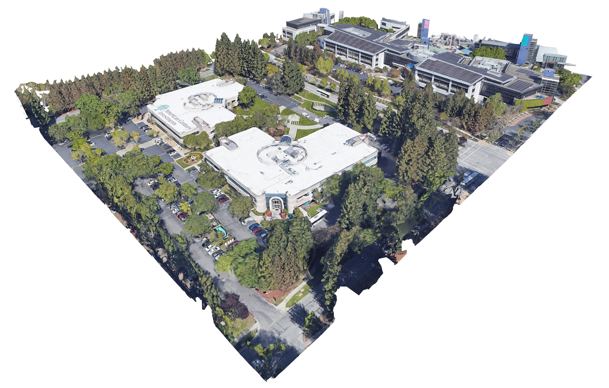

[](https://gitter.im/earth-reverse-engineering/lobby)



Earth to OBJ file downloader
```
# tested with node@8.15.0, npm@6.4.1
npm install
node index.js [octant] [max_level] [[--dump-json]] [[--dump-raw]]

# dump textured obj (octant from example.jpg)
node index.js 20527061605273514 20

# dump json and raw data
node index.js 20527061605273514 20 --dump-json --dump-raw
```


Notes
```
"https://kh.google.com/rt/🅐/🅑"
 - 🅐: planet
       - "earth"
       - "mars"
       - ...
 - 🅑: resource
       - "PlanetoidMetadata"
       - "BulkMetadata/pb=!1m2!1s❶!2u❷"
          - ❶: octant path
          - ❷: epoch
       - "NodeData/pb=!1m2!1s❸!2u❹!2e❺(!3u❻)!4b0"
          - ❸: octant path
          - ❹: epoch
          - ❺: texture format
          - ❻: imagery epoch (sometimes)

General info:
 - Everything is stored in an octree.

Roles of resources:
 - PlanetoidMetadata points to first BulkMetaData.
 - BulkMetaData points to other BulkMetaData and to NodeData.
 - NodeData contains actual meshes and textures.

Versioning:
 - BulkMetaData and NodeData are versioned using epoch numbers.
 - PlanetoidMetadata provides epoch of first BulkMetaData.
 - BulkMetaData provides epochs of underlying resources.
 - Current version of a resource can be determined recursively.
 
NodeData:
 - Vertex Buffer:
    - 8 bytes per point: X,Y,Z,W,U,U,V,V
    - XYZ: position, W: octant mask, UV: texture coordinates
 - Texture:
    - Format 1: JPEG
    - Format 6: S3 DXT1 RGB
```

Related ideas: [Racing game](https://www.reddit.com/r/Showerthoughts/comments/aex25s/race_car_video_games_could_be_amazing_if_they/) , [Minimal client](https://github.com/kaylathedev/google-maps-3d-client). WebGL + CORS should work ([test](https://retroplasma.github.io/get_planetoid_metadata.html)).
